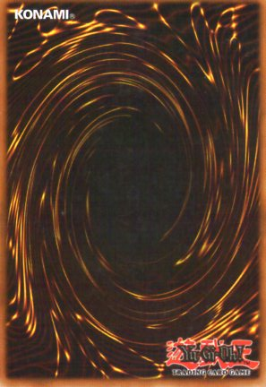

Cardgame

Cardgame is a game, in which the aim is to find the same cards in pairs, until you get to have turned them all over, when the two cards turned over are not equal, they are turned over and you have another attempt.

<!DOCTYPE html>
<html lang="en">

<head>
    <meta charset="UTF-8">
    <meta http-equiv="X-UA-Compatible" content="IE=edge">
    <meta name="viewport" content="width=device-width, initial-scale=1.0">
    <title>Document</title>

    
</head>

<body>

    

    
</body>

</html>
